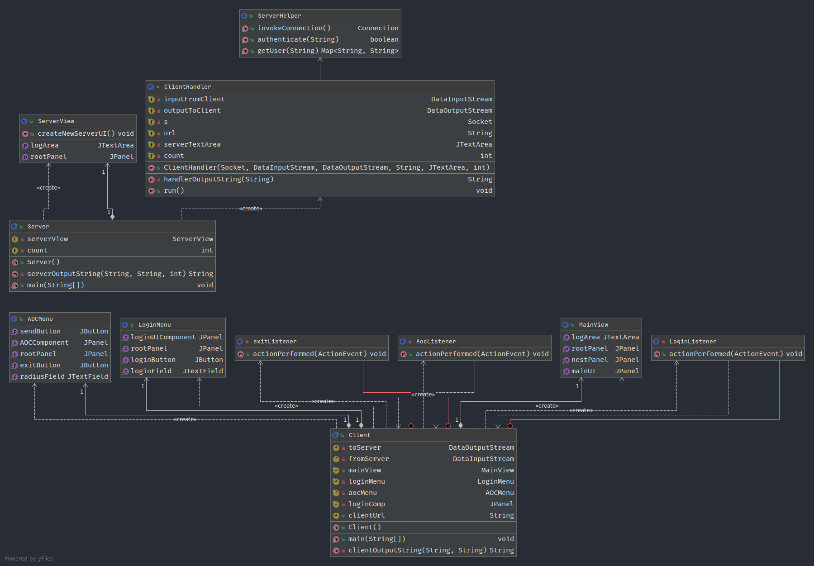

# multithreaded-client-and-server

## requirements
- a running LAMPP/XAMPP/MAMPP server with the table Assign2 as below

```
-- phpMyAdmin SQL Dump
-- version 4.9.0.1
-- https://www.phpmyadmin.net/
--
-- Host: localhost
-- Generation Time: Dec 04, 2020 at 02:21 PM
-- Server version: 10.3.16-MariaDB
-- PHP Version: 7.3.6

SET SQL_MODE = "NO_AUTO_VALUE_ON_ZERO";
SET AUTOCOMMIT = 0;
START TRANSACTION;
SET time_zone = "+00:00";


/*!40101 SET @OLD_CHARACTER_SET_CLIENT=@@CHARACTER_SET_CLIENT */;
/*!40101 SET @OLD_CHARACTER_SET_RESULTS=@@CHARACTER_SET_RESULTS */;
/*!40101 SET @OLD_COLLATION_CONNECTION=@@COLLATION_CONNECTION */;
/*!40101 SET NAMES utf8mb4 */;

--
-- Database: `Assign2`
--

-- --------------------------------------------------------

--
-- Table structure for table `students`
--

CREATE TABLE `students` (
  `SID` int(2) NOT NULL,
  `STUD_ID` int(8) NOT NULL,
  `FNAME` varchar(20) NOT NULL,
  `SNAME` varchar(20) NOT NULL,
  `TOT_REQ` int(8) NOT NULL
) ENGINE=InnoDB DEFAULT CHARSET=latin1;

--
-- Dumping data for table `students`
--

INSERT INTO `students` (`SID`, `STUD_ID`, `FNAME`, `SNAME`, `TOT_REQ`) VALUES
(1, 1, 'John', 'Doe', 76),
(2, 2, 'Jane', 'Doe', 25),
(3, 3, 'Jimmy', 'Doe', 19),
(4, 4, 'Joanne', 'Doe', 7);

--
-- Indexes for dumped tables
--

--
-- Indexes for table `students`
--
ALTER TABLE `students`
  ADD UNIQUE KEY `SID` (`SID`);
COMMIT;

/*!40101 SET CHARACTER_SET_CLIENT=@OLD_CHARACTER_SET_CLIENT */;
/*!40101 SET CHARACTER_SET_RESULTS=@OLD_CHARACTER_SET_RESULTS */;
/*!40101 SET COLLATION_CONNECTION=@OLD_COLLATION_CONNECTION */;
```
## UML diagram

